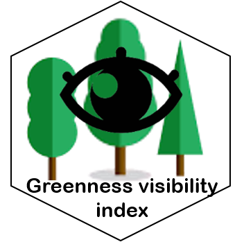

# Greenness Visibility Index 
R package available for this python programm at:  

This software uses a Python Viewshed implementation to calculate a GVI surface from a DSM, DTM and Binary Greenness Surface. It is part of the paper published at:
Labib, S.M., Huck, J.J. and Lindley, S., 2021. Modelling and mapping eye-level greenness visibility exposure using multi-source data at high spatial resolutions. Science of the Total Environment, 755, p.143050. https://doi.org/10.1016/j.scitotenv.2020.143050
